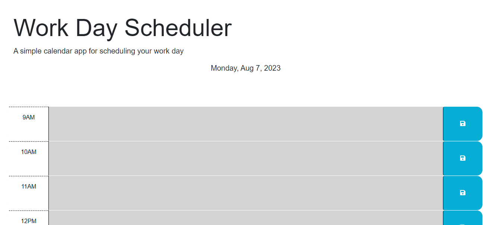

# Work Day Scheduler
## Description
This web app was created as a scheduler for a 9-5 job. If you're anything like me, you can forget what day you're living in quite often. 
To combat this, you can use this web application to set reminders, set tasks, and schedule events at certain hours. 
Check the Usage portion of the README to see more on how the site functions. It's pretty handy for staying on track and improve time efficiency if you know your targets.
 Making this app I learned about local storage and understanding how to target element identifiers to run code. 
 I also learned how to call a third party API (DayJs) to add site functionality in terms of dates and time. 

## Usage

Visit Page: https://kanabaki.github.io/calendar-scheduler/

When you load the page, you will be able to see today's date diplayed right above the time graph. The time table is used to schedule tasks for a 9-5 job. 
On the left you can see what hour you can set a task for. The hours will be marked with colors. If an hour is in the past, the block will diplay grey. 
If the time block coincides with the current hour, it will display in red. If the time block is in the future it is displayed in green. 
In the time blocks you can write reminders/tasks, and save them to local storage using the blue buttons on the right end of the time blocks.
If you refresh the page, you can see that your saved items will remain in the blocks.

## License
MIT License

Copyright (c) [2023] [Eduardo Perez]

Permission is hereby granted, free of charge, to any person obtaining a copy
of this software and associated documentation files (the "Software"), to deal
in the Software without restriction, including without limitation the rights
to use, copy, modify, merge, publish, distribute, sublicense, and/or sell
copies of the Software, and to permit persons to whom the Software is
furnished to do so, subject to the following conditions:

The above copyright notice and this permission notice shall be included in all
copies or substantial portions of the Software.

THE SOFTWARE IS PROVIDED "AS IS", WITHOUT WARRANTY OF ANY KIND, EXPRESS OR
IMPLIED, INCLUDING BUT NOT LIMITED TO THE WARRANTIES OF MERCHANTABILITY,
FITNESS FOR A PARTICULAR PURPOSE AND NONINFRINGEMENT. IN NO EVENT SHALL THE
AUTHORS OR COPYRIGHT HOLDERS BE LIABLE FOR ANY CLAIM, DAMAGES OR OTHER
LIABILITY, WHETHER IN AN ACTION OF CONTRACT, TORT OR OTHERWISE, ARISING FROM,
OUT OF OR IN CONNECTION WITH THE SOFTWARE OR THE USE OR OTHER DEALINGS IN THE
SOFTWARE.

---
